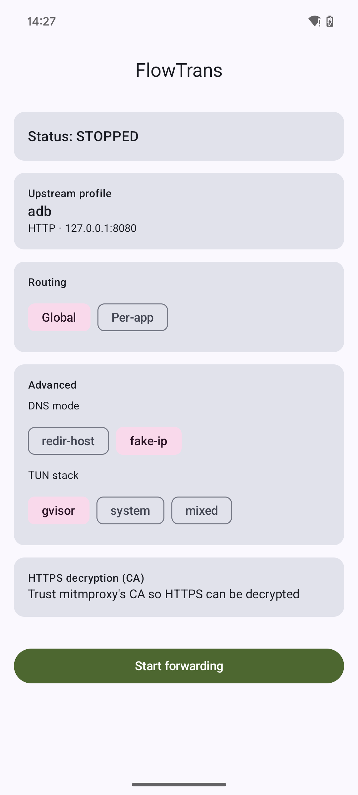
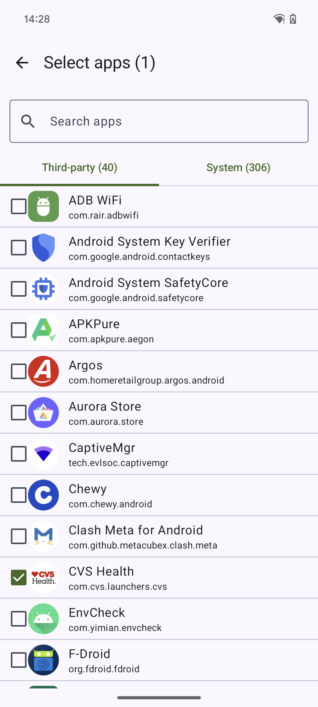

# FlowTrans

A **Postern / SocksDroid-style Android forwarding tool** built on the
[mihomo](https://github.com/MetaCubeX/mihomo) (Clash.Meta) core, made for
**packet-capture debugging with [mitmproxy](https://mitmproxy.org/)**.

FlowTrans captures device traffic through a `VpnService` TUN and **forwards it to an
upstream proxy** (your mitmproxy/mitmweb instance), with multiple saved profiles
(HTTP / HTTPS / SOCKS5), history, global or per-app routing, and a one-tap system-CA
helper for HTTPS decryption on rooted devices.

| Home | App picker |
|------|-----------|
|  |  |

## Features

- **Forward to mitmproxy** — routes all (or per-app) traffic through the VPN to an upstream
  `http` / `https` / `socks5` proxy. Real hostnames are preserved (SNI/Host) so mitmproxy sees
  domains, not IPs.
- **Profiles + history** — save multiple upstream targets (name, protocol, host, port, auth,
  TLS/SNI/skip-verify); the list doubles as history, ordered by last used. Backed by Room.
- **Global or per-app routing** — tunnel everything, or pick specific apps (search + system/
  third-party tabs + icons). Per-app uses the reliable `VpnService` allow-list.
- **DNS modes** — `redir-host` (safest for real hostnames) or `fake-ip` + sniffer.
- **HTTPS decryption helper** — on a rooted device, trust mitmproxy's CA in the system store so
  any app's HTTPS can be decrypted (see below).
- **mihomo core, prebuilt** — the Go core ships as a prebuilt `.so`, so the app builds with just
  the standard Android toolchain (no Go/NDK required).

## Download

Grab the latest APK from the [**Releases**](../../releases) page, or the per-build artifact from
the [Actions](../../actions) tab. Target: **arm64-v8a, Android 8+ (min SDK 24)**.

```
adb install -r FlowTrans-<version>.apk
```

## Usage

1. Run mitmproxy on your PC, e.g. `mitmweb --listen-host 0.0.0.0 -p 8080`.
2. In FlowTrans, add a profile pointing at your mitmproxy (`host:port`, protocol `HTTP`).
3. Pick **Global** or **Per-app** routing, then tap **Start forwarding** (accept the VPN prompt).
4. Watch the flows in mitmproxy.

**Can't reach your PC over Wi-Fi?** Corporate networks often block inbound or isolate clients. Use
the adb loopback tunnel instead — set the profile host to `127.0.0.1` and run:

```
adb reverse tcp:8080 tcp:8080
```

### HTTPS decryption

Since Android 7, apps don't trust user-added CAs, and on Android 14 the system store lives in the
immutable Conscrypt APEX. So decrypting **other apps'** HTTPS needs **root**:

- **Rooted (recommended):** import mitmproxy's CA (`~/.mitmproxy/mitmproxy-ca-cert.cer`) via the
  in-app **HTTPS decryption** screen. With a Magisk/KernelSU module such as
  [MoveCertificate](https://github.com/ys1231/MoveCertificate), it is promoted into the system
  store (reboot to apply), and mitmproxy can then decrypt any non-pinned app.
- **Non-rooted:** only apps that opt into the user CA store can be decrypted.

## Build from source

Requires **JDK 17** and the **Android SDK** (platform 34, build-tools 34.0.0). No Go/NDK needed —
the mihomo core is vendored prebuilt.

```bash
# point Gradle at your JDK 17 and SDK
export JAVA_HOME=/path/to/jdk-17
echo "sdk.dir=/path/to/Android/Sdk" > local.properties

./gradlew assembleDebug
adb install -r app/build/outputs/apk/debug/app-debug.apk
```

CI (`.github/workflows/build.yml`) builds the APK on every push and attaches it to a GitHub Release
when you push a `v*` tag.

## Architecture

```
FlowTrans app (Android)                                    PC
┌───────────────────────────────────────────┐       ┌──────────────┐
│ Compose UI ─ profiles / routing / CA        │       │              │
│      │ generates config.yaml                │       │  mitmproxy   │
│      ▼                                       │       │  :8080       │
│ mihomo core (libclash.so + libbridge.so) ───┼──LAN─▶│  decrypts    │
│      ▲   outbound: http / socks5            │       │  (system CA  │
│ VpnService TUN ◀─ fd → Bridge.startTun()    │       │   via root)  │
└───────────────────────────────────────────┘       └──────────────┘
```

- `com.flowtrans.vpn.FlowVpnService` — establishes the TUN and hands its fd to the core.
- `com.flowtrans.core.ConfigBuilder` — renders the mihomo `config.yaml` from the active profile.
- `com.flowtrans.data.*` — Room profiles + settings.
- `com.flowtrans.root.CaInstaller` — system-CA trust helper.
- `com.github.kr328.clash.*` — vendored bridge to the prebuilt mihomo core.

## License & credits

GPL-3.0 (see [LICENSE](LICENSE) and [NOTICE](NOTICE)). Built on and bundling
[mihomo](https://github.com/MetaCubeX/mihomo) and
[ClashMetaForAndroid](https://github.com/MetaCubeX/ClashMetaForAndroid) (both GPL-3.0).
For educational / authorized debugging use only.
